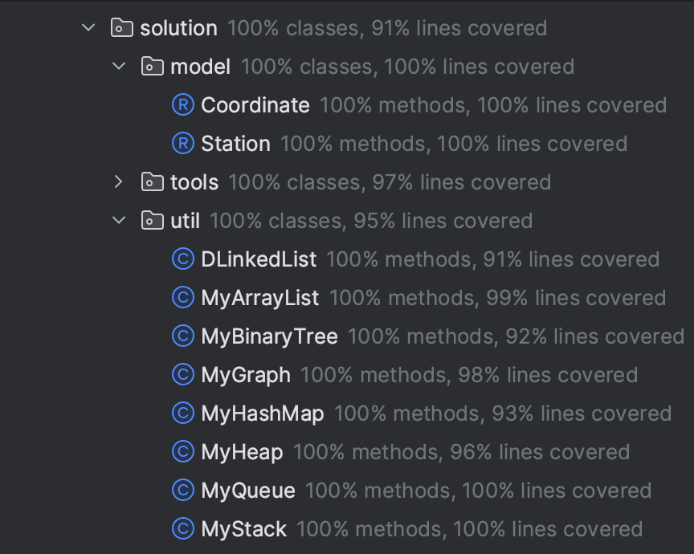
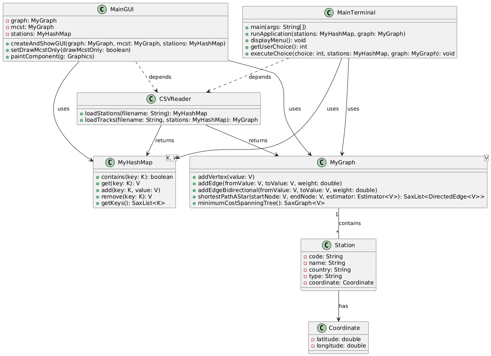
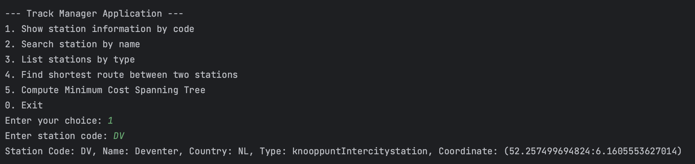
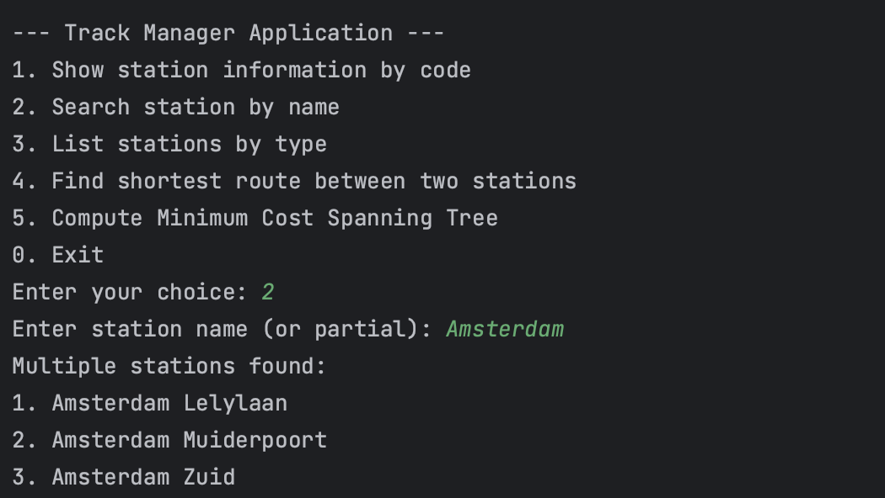
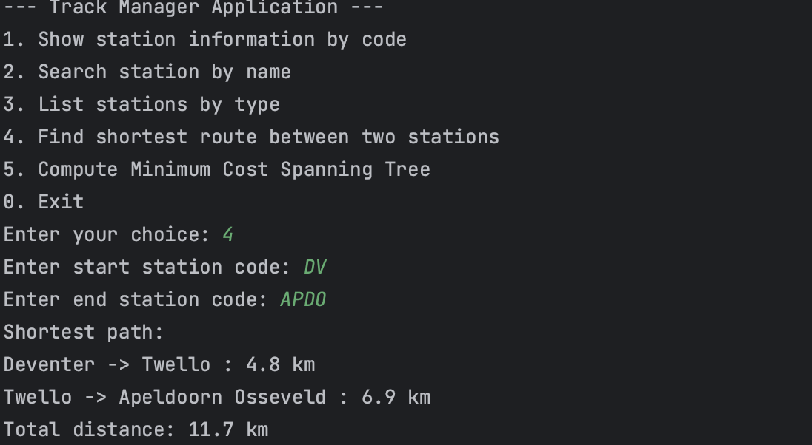
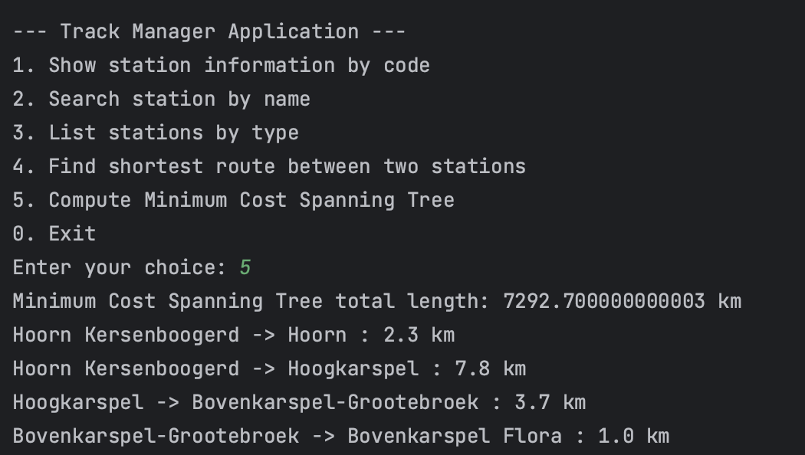
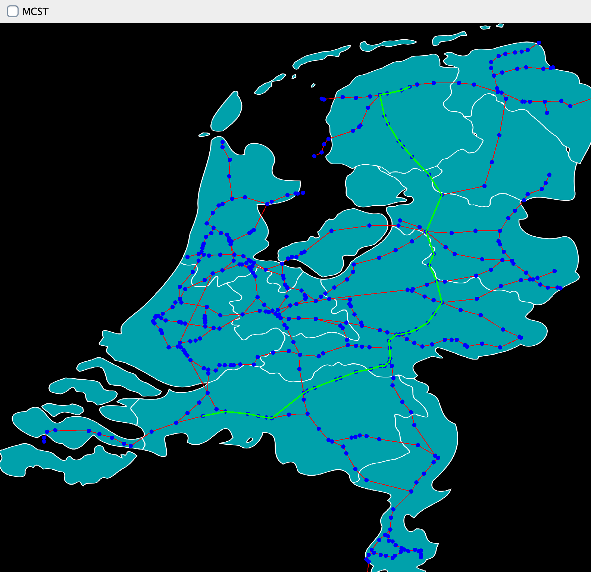
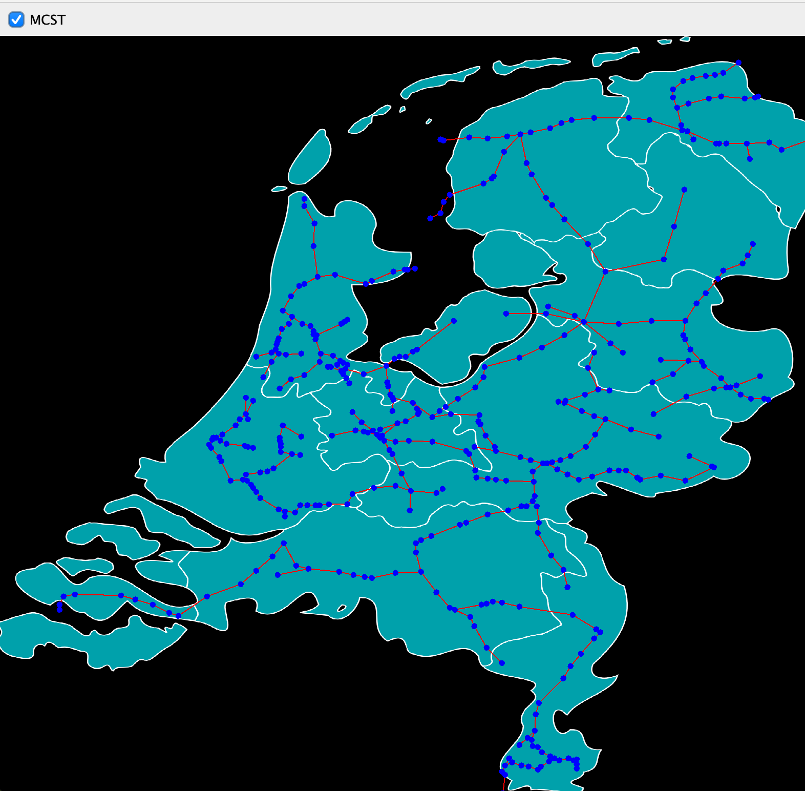

# Algoritmen en klassen

## My ArrayList

**Implementation**: [MyArrayList.java](../src/nl/saxion/cds/solution/util/MyArrayList.java)

### My binary search algorithm
- **Classification**: \(O(\log(N))\)
- **Implementation**: [binarySearch](../src/nl/saxion/cds/solution/util/MyArrayList.java#L420)
    - This algorithm performs a binary search, which requires the list to be sorted. It repeatedly divides the search range in half until it finds the target element or determines it is absent.
    - The algorithm first checks if the list is sorted using the [`isSorted` method](../src/nl/saxion/cds/solution/util/MyArrayList.java#L373). If not, it throws a `ListNotSortedException`.
    - It sets the initial boundaries (`left` and `right`) to the start and end of the list. Then, on each iteration, it calculates `middle`. Based on the value at `middle`, the search range is narrowed until a match is found.

### My linear search algorithm
- **Classification**: \(O(N)\)
- **Implementation**: [linearSearch](../src/nl/saxion/cds/solution/util/MyArrayList.java#L402)
    - Linear search iterates through each element in the list sequentially until it finds the target element or reaches the end.
    - This method is useful for unsorted data as it checks each element in sequence.

### My QuickSort algorithm
- **Classification**: \(O(N \log(N))\) on average
- **Implementation**: [quickSort](../src/nl/saxion/cds/solution/util/MyArrayList.java#L353)
    - The `quickSort` implementation uses the [`splitInPlace` method](../src/nl/saxion/cds/solution/util/MyArrayList.java#L419) to partition the array around a pivot element (the first element in the current range). All elements smaller than the pivot move to the left, while larger elements move to the right.
    - The algorithm recursively calls `quickSort` on the left and right partitions relative to the pivot until the entire array is sorted.

## My BST(AVL)

**Implementation**: [MyBinaryTree.java](../src/nl/saxion/cds/solution/util/MyBinaryTree.java)

### contains method
- **Classification**: \(O(\log(N))\)
- **Implementation**: [contains](../src/nl/saxion/cds/solution/util/MyBinaryTree.java#L26)
    - This method checks if a specific key exists in the tree by searching for it using a binary search approach.

### get method
- **Classification**: \(O(\log(N))\)
- **Implementation**: [get](../src/nl/saxion/cds/solution/util/MyBinaryTree.java#L37)
    - Retrieves the value associated with a given key by locating the node and returning its value if it exists.

### add method
- **Classification**: \(O(\log(N))\)
- **Implementation**: [add](../src/nl/saxion/cds/solution/util/MyBinaryTree.java#L71)
    - Inserts a new key-value pair into the tree. If the key already exists, it throws a `DuplicateKeyException`.
    - This method balances the tree after insertion using AVL rotation if necessary.

### remove method
- **Classification**: \(O(\log(N))\)
- **Implementation**: [remove](../src/nl/saxion/cds/solution/util/MyBinaryTree.java#L111)
    - Removes the node associated with a specified key. If the key is not found, it throws a `KeyNotFoundException`.
    - Balances the tree after deletion if needed to maintain AVL properties.

### getKeys method
- **Classification**: \(O(N)\)
- **Implementation**: [getKeys](../src/nl/saxion/cds/solution/util/MyBinaryTree.java#L277)
    - Returns a list of all keys in the tree in ascending order using in-order traversal.

### balance method
- **Classification**: \(O(1)\)
- **Implementation**: [balance](../src/nl/saxion/cds/solution/util/MyBinaryTree.java#L208)
    - Balances a node if it is unbalanced by performing left or right rotations as necessary.

### rotate method
- **Classification**: \(O(1)\)
- **Implementation**: [rotate](../src/nl/saxion/cds/solution/util/MyBinaryTree.java#L234)
    - Performs a rotation (left or right) on a given node to maintain AVL balance.

## My HashMap

**Implementation**: [MyHashMap.java](../src/nl/saxion/cds/solution/util/MyHashMap.java)

### contains method
- **Classification**: \(O(1)\) on average, \(O(N)\) in the worst case
- **Implementation**: [contains](../src/nl/saxion/cds/solution/util/MyHashMap.java#L112)
    - Checks if a specific key exists in the map by locating the node associated with it.

### get method
- **Classification**: \(O(1)\) on average, \(O(N)\) in the worst case
- **Implementation**: [get](../src/nl/saxion/cds/solution/util/MyHashMap.java#L123)
    - Retrieves the value mapped to the specified key by finding the node in the hash table.

### add method
- **Classification**: \(O(1)\) on average, \(O(N)\) in the worst case
- **Implementation**: [add](../src/nl/saxion/cds/solution/util/MyHashMap.java#L158)
    - Adds a new key-value pair. If the key already exists, throws `DuplicateKeyException`. Resizes the table if needed.

### put method
- **Classification**: \(O(1)\) on average, \(O(N)\) in the worst case
- **Implementation**: [put](../src/nl/saxion/cds/solution/util/MyHashMap.java#L183)
    - Associates a value with a key, updating the value if the key already exists.

### remove method
- **Classification**: \(O(1)\) on average, \(O(N)\) in the worst case
- **Implementation**: [remove](../src/nl/saxion/cds/solution/util/MyHashMap.java#L202)
    - Removes the node associated with the specified key. Throws `KeyNotFoundException` if the key is absent.

### getKeys method
- **Classification**: \(O(N)\)
- **Implementation**: [getKeys](../src/nl/saxion/cds/solution/util/MyHashMap.java#L233)
    - Returns a list of all keys in the map.

### checkAndExtendSize method
- **Classification**: \(O(N)\) when resizing
- **Implementation**: [checkAndExtendSize](../src/nl/saxion/cds/solution/util/MyHashMap.java#L243)
    - Checks the load factor and doubles the table size if necessary, rehashing all elements.

## My Heap

**Implementation**: [MyHeap.java](../src/nl/saxion/cds/solution/util/MyHeap.java)

### isEmpty method
- **Classification**: \(O(1)\)
- **Implementation**: [isEmpty](../src/nl/saxion/cds/solution/util/MyHeap.java#L27)
    - Checks if the heap has no elements.

### size method
- **Classification**: \(O(1)\)
- **Implementation**: [size](../src/nl/saxion/cds/solution/util/MyHeap.java#L37)
    - Returns the number of elements in the heap.

### enqueue method
- **Classification**: \(O(\log(N))\)
- **Implementation**: [enqueue](../src/nl/saxion/cds/solution/util/MyHeap.java#L81)
    - Adds a new value to the heap and restores the heap property by percolating the element up.

### dequeue method
- **Classification**: \(O(\log(N))\)
- **Implementation**: [dequeue](../src/nl/saxion/cds/solution/util/MyHeap.java#L105)
    - Removes and returns the root element, then restores the heap property by percolating the last element down.

### peek method
- **Classification**: \(O(1)\)
- **Implementation**: [peek](../src/nl/saxion/cds/solution/util/MyHeap.java#L145)
    - Returns the root element without removing it.

## My Stack

**Implementation**: [MyStack.java](../src/nl/saxion/cds/solution/util/MyStack.java)

### isEmpty method
- **Classification**: \(O(1)\)
- **Implementation**: [isEmpty](../src/nl/saxion/cds/solution/util/MyStack.java#L27)
    - Checks if the stack has no elements.

### size method
- **Classification**: \(O(1)\)
- **Implementation**: [size](../src/nl/saxion/cds/solution/util/MyStack.java#L37)
    - Returns the number of elements in the stack.

### push method
- **Classification**: \(O(1)\) on average, \(O(N)\) in the worst case
- **Implementation**: [push](../src/nl/saxion/cds/solution/util/MyStack.java#L59)
    - Adds a value to the top of the stack.

### pop method
- **Classification**: \(O(1)\)
- **Implementation**: [pop](../src/nl/saxion/cds/solution/util/MyStack.java#L69)
    - Removes and returns the top value from the stack.

### peek method
- **Classification**: \(O(1)\)
- **Implementation**: [peek](../src/nl/saxion/cds/solution/util/MyStack.java#L79)
    - Returns the top value without removing it.

## My Queue

**Implementation**: [MyQueue.java](../src/nl/saxion/cds/solution/util/MyQueue.java)

### isEmpty method
- **Classification**: \(O(1)\)
- **Implementation**: [isEmpty](../src/nl/saxion/cds/solution/util/MyQueue.java#L27)
    - Checks if the queue has no elements.

### size method
- **Classification**: \(O(1)\)
- **Implementation**: [size](../src/nl/saxion/cds/solution/util/MyQueue.java#L37)
    - Returns the number of elements in the queue.

### enqueue method
- **Classification**: \(O(1)\)
- **Implementation**: [enqueue](../src/nl/saxion/cds/solution/util/MyQueue.java#L59)
    - Adds a value to the end of the queue.

### dequeue method
- **Classification**: \(O(1)\)
- **Implementation**: [dequeue](../src/nl/saxion/cds/solution/util/MyQueue.java#L69)
    - Removes and returns the value at the front of the queue.

### peek method
- **Classification**: \(O(1)\)
- **Implementation**: [peek](../src/nl/saxion/cds/solution/util/MyQueue.java#L82)
    - Returns the value at the front of the queue without removing it.

## My Graph
Implementation: [MyGraph.java](../src/nl/saxion/cds/solution/util/MyGraph.java)

### isEmpty method
- **Classification**: \(O(1)\)
- **Implementation**: [isEmpty](../src/nl/saxion/cds/solution/util/MyGraph.java#L26)
    - Checks if the graph has no vertices.

### size method
- **Classification**: \(O(1)\)
- **Implementation**: [size](../src/nl/saxion/cds/solution/util/MyGraph.java#L36)
    - Returns the number of vertices in the graph.

### addVertex method
- **Classification**: \(O(1)\) on average
- **Implementation**: [addVertex](../src/nl/saxion/cds/solution/util/MyGraph.java#L75)
    - Adds a vertex to the graph if it doesn’t already exist.

### addEdge method
- **Classification**: \(O(1)\)
- **Implementation**: [addEdge](../src/nl/saxion/cds/solution/util/MyGraph.java#L93)
    - Adds a directed edge between two vertices with a specified weight.

### addEdgeBidirectional method
- **Classification**: \(O(1)\)
- **Implementation**: [addEdgeBidirectional](../src/nl/saxion/cds/solution/util/MyGraph.java#L110)
    - Adds two directed edges to make a bidirectional connection between vertices.

### getEdges method
- **Classification**: \(O(1)\)
- **Implementation**: [getEdges](../src/nl/saxion/cds/solution/util/MyGraph.java#L124)
    - Retrieves a list of edges originating from a specified vertex.

### getTotalWeight method
- **Classification**: \(O(N)\)
- **Implementation**: [getTotalWeight](../src/nl/saxion/cds/solution/util/MyGraph.java#L135)
    - Calculates the total weight of all edges in the graph.

### My iterative depth first search algorithm
- **Classification**: \(O(N)\)
- **Implementation**: [DFSIterator](../src/nl/saxion/cds/solution/util/MyGraph.java#L346)
    - **Explanation**: The DFS algorithm iterates over each vertex and each edge once, resulting in a time complexity of \(O(N)\). Each vertex is marked as visited once, and each edge is processed once to explore connected vertices.

### My Dijkstra algorithm
- **Classification**: \(O(N \log N)\)
- **Implementation**: [shortestPathsDijkstra](../src/nl/saxion/cds/solution/util/MyGraph.java#L152)
    - **Explanation**: Dijkstra’s algorithm maintains a priority queue to fetch the next closest vertex efficiently, which incurs a \(O(\log N)\) cost per operation. Since each vertex is added to the queue once and each edge is processed once, the overall complexity is \(O(N \log N)\). This complexity arises from the cost of updating and retrieving elements from the priority queue.

### My A* algorithm
- **Classification**: \(O(N \log N)\)
- **Implementation**: [shortestPathAStar](../src/nl/saxion/cds/solution/util/MyGraph.java#L196)
    - **Explanation**: The A* algorithm, like Dijkstra, uses a priority queue to manage vertices by estimated total path cost. Each vertex and edge is processed similarly, with queue operations adding \(O(\log N)\) complexity per vertex. Consequently, the A* algorithm also operates in \(O(N \log N)\), as each vertex and edge is expanded once, with priority queue updates contributing to the logarithmic factor.

### My MCST algorithm
- **Classification**: \(O(N \log N)\)
- **Implementation**: [minimumCostSpanningTree](../src/nl/saxion/cds/solution/util/MyGraph.java#L258)
    - **Explanation**: The Minimum Cost Spanning Tree (MCST) algorithm relies on sorting edges in increasing order of weight, typically achieved with a priority queue or sorting method with \(O(N \log N)\) complexity. This complexity arises because we process each edge once and use a priority queue to efficiently select the next minimum-weight edge.

# Technical design My Application
## Test Coverage

- The application has achieved a test coverage of over 91% for its core functionality, excluding the `MainGUI` class. Testing `MainGUI` is challenging due to its reliance on user interactions and graphical components, which are inherently difficult to automate. However, all other classes and methods have been thoroughly tested to ensure robust functionality and reliability.

## Class diagram and reading the data

- The application’s data is loaded from two CSV files:
  - **`stations.csv`**: Contains details about each station (e.g., code, name, coordinates, type, etc.).
  - **`tracks.csv`**: Describes the connections (tracks) between stations, including the distance.
- **Class Diagram**: The application consists of several main classes:
  - **`MainTerminal`**: Provides a command-line interface for interacting with station data, viewing routes, and computing a Minimum Cost Spanning Tree (MCST).
  - **`MainGUI`**: A GUI component visualizing the railway network, allowing users to see stations, MCST, and find the shortest path between stations.
  - **`Station`**: Represents a railway station with attributes such as name, code, type, and coordinates.
  - **`CSVReader`**: Reads station and track data from CSV files and initializes `MyGraph<Station>` and `MyHashMap<String, Station>`.
  - **`MyGraph`**: A directed, weighted graph representing connections between stations.

# Station search by station code
### Implementation:
- **Method**: [`showStationByCode`](../src/nl/saxion/cds/solution/MainTerminal.java#L122)
- **Complexity**: \(O(1)\) average, as it leverages a hash map lookup.
  - Receives the station code, looks up the station in the hash map, and prints station details.
  - Outputs an error if the station code does not exist.

# Station search based on the beginning of the name
## Station search based on the beginning of the name
- **Method**: [`searchStationsByName`](../src/nl/saxion/cds/solution/MainTerminal.java#L137)
- **Functionality**: Searches stations by a partial match on the name, showing results in a list format.
- **Complexity**: \(O(N)\), as it iterates through all keys in the hash map.

## Implementation shortest route
- **Method**: [`findShortestRoute`](../src/nl/saxion/cds/solution/MainTerminal.java#L195)
- **Functionality**: Finds the shortest route between two stations using the A* algorithm.
- **Complexity**: \(O(N \log N)\)

## Implementation minimum cost spanning tree
- **Method**: [`computeMCST`](../src/nl/saxion/cds/solution/MainTerminal.java#L218)
- **Functionality**: Computes and displays the MCST of the station graph using a minimum spanning tree algorithm. Utilizes the `minimumCostSpanningTree` method to compute the MCST. Outputs each edge in the MCST along with the total weight.
- **Complexity**: \(O(N \log N)\).

## Implementation graphic representation(s)
### Class: `MainGUI`
### Components
- **Station Representation**: Stations are represented as small circles with the option to view connections.

- **Shortest Path Visualization**: Highlights the shortest path in green between selected stations by clicking and moving the mouse.

- **MCST Toggle**: Provides a checkbox to switch between viewing the full network or only the MCST.

